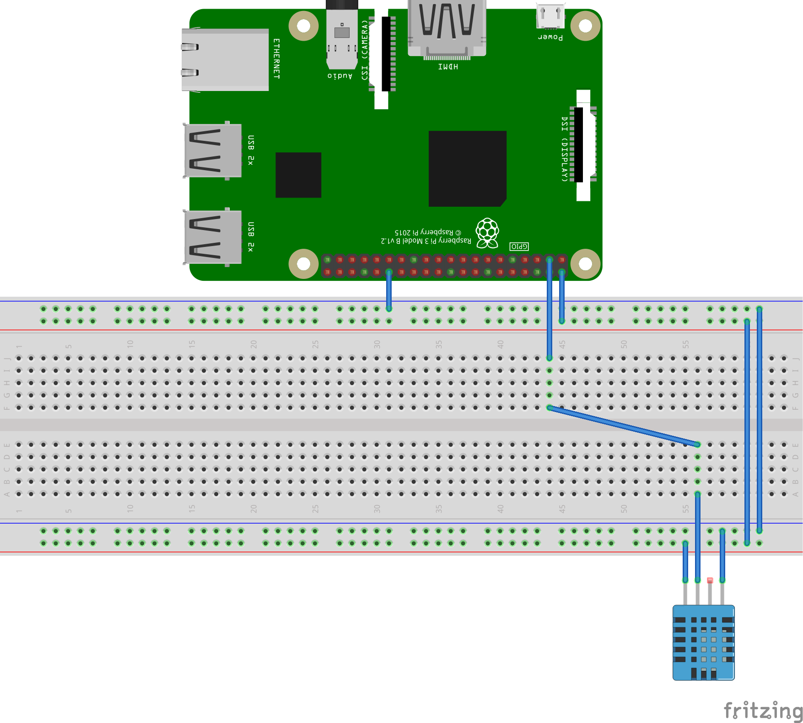
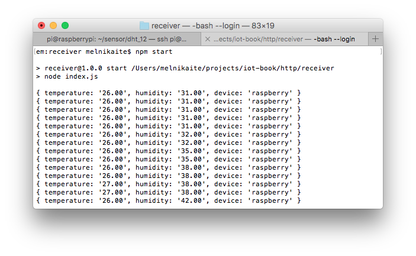
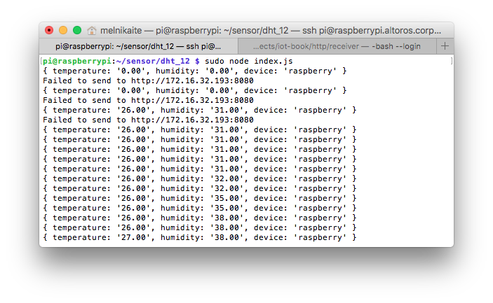

# Application level protocols: HTTP
This example shows an application which runs on Raspberry Pi and sends data from DHT-12 Temparature and Humidity Sensor module

## Software
* [Node.js 6+](https://nodejs.org/en/download/)
* [request](https://www.npmjs.com/package/request)
* [rpi-dht-sensor](https://www.npmjs.com/package/rpi-dht-sensor)
* [Docker](https://docs.docker.com/engine/installation/)

## Prepare hardware components
* Raspberry Pi 3 (Model B)
* Power Adapter (2A/5V)
* MicroSD Card (8GB+) and SD Adapter
* DHT-12 Temparature and Humidity Sensor module
* Breadboard and a set of dupont cables
* Ethernet cable for wired network connection

## Assemble the device


## Prepare SD card
* Download [the latest Raspbian LITE image](https://www.raspberrypi.org/downloads/raspbian/)
* Connect you SD card to your computer and use [Etcher](https://etcher.io/) to flash the Raspbian .img-file to the SD card
* Enable SSH:
  ```
  cd /Volumes/boot
  touch ssh
  ```
* To enable Wi-Fi create `wpa_supplicant.conf` with the following content:
  ```
  network={
      ssid="YOUR_SSID"
      psk="YOUR_WIFI_PASSWORD"
  }
  ```
* Create folder `/home/pi/sensor`
* Create file `/home/pi/sensor/package.json` with the following contents:
  ```
  {
    "name": "sensor",
    "version": "1.0.0",
    "description": "",
    "main": "index.js",
    "scripts": {
      "start": "node index.js",
      "test": "echo \"Error: no test specified\" && exit 1"
    },
    "author": "",
    "license": "ISC",
    "dependencies": {
      "request": "^2.81.0",
      "rpi-dht-sensor": "^0.1.1"
    }
  }
  ```
* Create file `/home/pi/sensor/index.js` with the following contents, replacing `REMOTE-SERVER-ADDRESS.com` with real value:
  ```
  var rpiDhtSensor = require('rpi-dht-sensor');
  var request = require('request');

  var receiver = 'http://REMOTE-SERVER-ADDRESS.com:8080';
  var dht = new rpiDhtSensor.DHT11(2);

  function read () {
    var readout = dht.read();
    var data = {
      temperature: readout.temperature.toFixed(2),
      humidity: readout.humidity.toFixed(2)
    };
    console.log(data);
    data.device = 'raspberry';
    request.post({url: receiver, form: data}, function(err) {
      if(err) console.log('Failed to send to ' + receiver);
    });
    setTimeout(read, 1000);
  }

  read();
  ```
* Create file `/home/pi/sensor/Dockerfile` with the following contents:
  ```
  FROM hypriot/rpi-node:boron-onbuild
  ```

## Run the sensor application on RPi
* Insert SD card into the RPi
* Connect Ethernet cable and open SSH connection
* Navigate to `/home/pi/sensor`
* Build an image and run Docker container:
  ```
  # Build an image from a Dockerfile
  docker build -t http-sensor .
  #
  # Run container in foreground
  docker run --privileged -it --rm --name http-sensor-container http-sensor
  #
  # Run container in background
  # docker run --privileged -d  --rm --name http-sensor-container http-sensor
  #
  # Fetch the logs of a container
  # docker logs -f http-sensor-container
  #
  # Stop running container
  # docker stop http-sensor-container
  ```
  

## Run the receiver application on your PC
* Create folder `receiver`
* Create file `./receiver/package.json` with the following contents:
   ```
  {
    "name": "receiver",
    "version": "1.0.0",
    "description": "",
    "main": "index.js",
    "scripts": {
      "start": "node index.js",
      "test": "echo \"Error: no test specified\" && exit 1"
    },
    "author": "",
    "license": "ISC"
  }
  ```
* Create file `./receiver/index.js` with the following contents:
   ```
  var http = require('http');
  var querystring = require('querystring');

  http.createServer(function (req, res) {
    req.on('data', function (chunk) {
      var data = querystring.parse(chunk.toString());
      console.log(data);
    });
    req.on('end', function () {
      res.writeHead(200, 'OK', {'Content-Type': 'text/html'});
      res.end('Data received.')
    });
  }).listen(8080);
   ```
* Create file `./receiver/Dockerfile` with the following contents:
   ```
  FROM node:boron-onbuild
  
  EXPOSE 8080
   ```
* Navigate to `./receiver`
* Build an image and run Docker container:
  ```
  # Build an image from a Dockerfile
  docker build -t http-receiver .
  
  # Run container in foreground
  docker run -p 8080:8080 -it --rm --name http-receiver-container http-receiver
  
  # Run container in background
  # docker run -p 8080:8080 -d  --rm --name http-receiver-container http-receiver
  
  # Fetch the logs of a container
  # docker logs -f http-sensor-container
  
  # Stop running container
  # docker stop http-receiver-container
  ```
  
