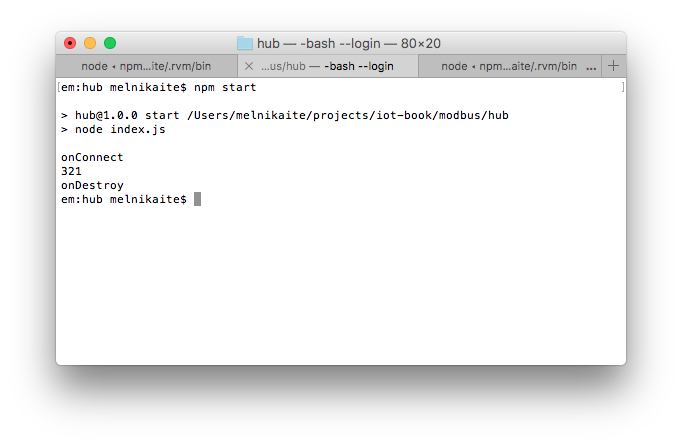
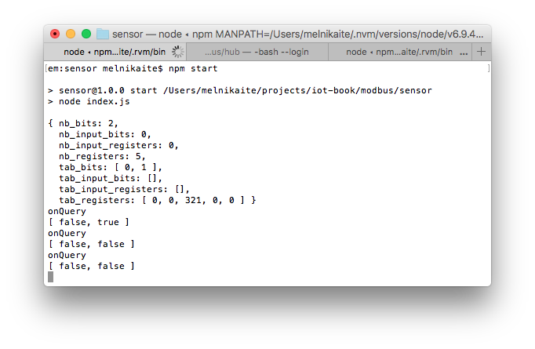
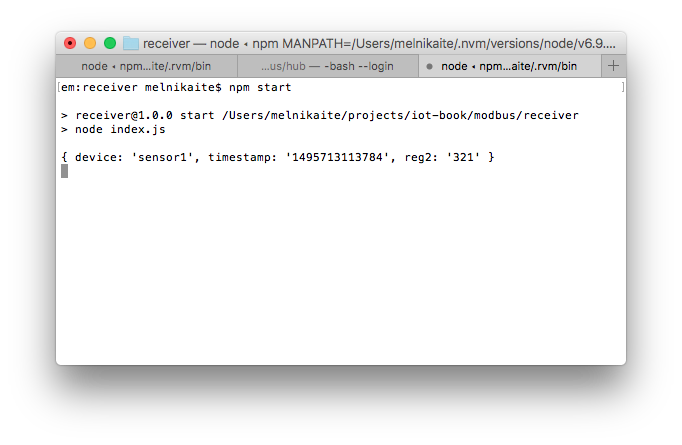

# Application level protocols: Modbus
This example shows an application which runs on Raspberry Pi, collects the data from Modbus simulator and sends it to the cloud

## Software
* [Node.js 6+](https://nodejs.org/en/download/)
* [PostgreSQL](https://www.postgresql.org/download/)
* [CF CLI](https://github.com/cloudfoundry/cli#downloads)
* [request](https://www.npmjs.com/package/request)
* [modbus](https://www.npmjs.com/package/modbus)
* [Docker](https://docs.docker.com/engine/installation/)

## Prepare hardware components
* Raspberry Pi 3 (Model B)
* Power Adapter (2A/5V)
* MicroSD Card (8GB+) and SD Adapter
* Ethernet cable for wired network connection

## Prepare SD card
* Download [the latest Raspbian LITE image](https://www.raspberrypi.org/downloads/raspbian/)
* Connect you SD card to your computer and use [Etcher](https://etcher.io/) to flash the Raspbian .img-file to the SD card
* Enable SSH:
  ```
  cd /Volumes/boot
  touch ssh
  ```
* To enable Wi-Fi create `wpa_supplicant.conf` with the following content:
  ```
  network={
      ssid="YOUR_SSID"
      psk="YOUR_WIFI_PASSWORD"
  }
  ```
* Create folder `/home/pi/hub`
* Create file `/home/pi/hub/package.json` with the following contents:
  ```
  {
    "name": "hub",
    "version": "1.0.0",
    "description": "",
    "main": "index.js",
    "scripts": {
      "start": "node index.js",
      "test": "echo \"Error: no test specified\" && exit 1"
    },
    "author": "",
    "license": "ISC",
    "dependencies": {
      "modbus": "0.0.16",
      "request": "^2.81.0"
    }
  }
  ```
* Create file `/home/pi/hub/index.js` with the following contents, replacing `REMOTE-SERVER-ADDRESS.com` and `REMOTE-SENSOR-ADDRESS` with real values:
  ```
  var request = require('request');

  var log = console.log;
  //var mb = require('modbus').create(true); // enable debug output
  var mb = require('modbus').create();

  var sensor = 'REMOTE-SENSOR-ADDRESS';
  var receiver = 'http://REMOTE-SERVER-ADDRESS.com:8080';

  mb.onError(function (msg) {
    log('ERROR', msg);
  });

  // create master device
  var ctx = mb.createMaster({

    // connection type and params
    con: mb.createConTcp(sensor, 1502),
    //con: mb.createConRtu(1, '/dev/ttyS1', 9600),

    // callback functions
    onConnect: function () {
      log('onConnect');
      log(ctx.getReg(2));
      ctx.setBit(1, false);

      //send to receiver
      var data = {
        device: 'sensor1',
        timestamp: Date.now(),
        reg2: ctx.getReg(2)
      };
      request.post({url: receiver, form: data}, function (err) {
        if (err) console.log('Failed to send to ' + receiver);
      });

      ctx.destroy();
    },
    onDestroy: function () {
      log('onDestroy');
    }
  });
  ```
* Create file `/home/pi/hub/Dockerfile` with the following contents:
  ```
  FROM hypriot/rpi-node:boron-onbuild

  RUN apt-get update && apt-get install -y libmodbus5
  ```
* Create folder `/home/pi/sensor`
* Create file `/home/pi/sensor/package.json` with the following contents:
   ```
  {
    "name": "sensor",
    "version": "1.0.0",
    "description": "",
    "main": "index.js",
    "scripts": {
      "start": "node index.js",
      "test": "echo \"Error: no test specified\" && exit 1"
    },
    "author": "",
    "license": "ISC",
    "dependencies": {
      "modbus": "0.0.16"
    }
  }
  ```
* Create file `/home/pi/sensor/index.js` with the following contents, replacing `REMOTE-HUB-ADDRESS.com` with real value:
   ```
  var log = console.log;
  var mb = require('modbus').create();

  mb.onError(function (msg) {
    log('ERROR', msg);
  });

  // create device memory map
  var data = mb.createData({ countReg: 5, countBit: 2 });
  data.setReg(2, 321);
  data.setBit(1, true);
  data.dumpData(); // show memory map

  // create slave device
  var ctx = mb.createSlave({

    // connection type and params
    con: mb.createConTcp('REMOTE-HUB-ADDRESS.com', 1502),
    //con: mb.createConRtu(1, '/dev/ttyS0', 9600),

    // data map
    data: data,

    // callback functions
    onQuery: function () {
      log('onQuery');
      //ctx.dumpData();
      log(ctx.getBits(0, 2));
    },
    onDestroy: function () {
      log('onDestroy');
    }
  });

  // destroy device
  //setTimeout(function () {
  //	ctx.destroy();
  //}, 5000);
   ```
* Create file `/home/pi/sensor/Dockerfile` with the following contents:
  ```
  FROM hypriot/rpi-node:boron-onbuild

  RUN apt-get update && apt-get install -y libmodbus5
  ```

## Run hub application on RPi
* Insert SD card into the RPi
* Connect Ethernet cable and open SSH connection
* Navigate to `/home/pi/hub`
* Build an image and run Docker container:
  ```
  # Build an image from a Dockerfile
  docker build -t modbus-hub .
  #
  # Run container in foreground
  docker run --privileged -it --rm --name modbus-hub-container modbus-hub
  #
  # Run container in background
  # docker run --privileged -d  --rm --name modbus-hub-container modbus-hub
  #
  # Fetch the logs of a container
  # docker logs -f modbus-hub-container
  #
  # Stop running container
  # docker stop modbus-hub-container
  ```
  

## Run simulator application on RPi
* Open SSH connection
* Navigate to `/home/pi/sensor`
* Build an image and run Docker container:
  ```
  # Build an image from a Dockerfile
  docker build -t modbus-sensor .
  #
  # Run container in foreground
  docker run -p 1502:1502 --privileged -it --rm --name modbus-sensor-container modbus-sensor
  #
  # Run container in background
  # docker run -p 1502:1502 --privileged -d  --rm --name modbus-sensor-container modbus-sensor
  #
  # Fetch the logs of a container
  # docker logs -f modbus-sensor-container
  #
  # Stop running container
  # docker stop modbus-sensor-container
  ```
  

## Run the receiver application on your PC
* Install and launch PostgreSQL container:
  ```
  docker run --rm --name postgres-container -e POSTGRES_PASSWORD=password -it -p 5433:5432 postgres
  
  docker exec -it postgres-container createdb -U postgres iot-book
  ```
* Create folder `receiver`
* Create file `./receiver/package.json` with the following contents:
   ```
  {
    "name": "receiver",
    "version": "1.0.0",
    "description": "",
    "main": "index.js",
    "scripts": {
      "start": "node index.js",
      "test": "echo \"Error: no test specified\" && exit 1"
    },
    "author": "",
    "license": "ISC",
    "dependencies": {
      "pg": "^6.2.3"
    }
  }
  ```
* Create file `./receiver/index.js` with the following contents, replacing database credentials with the correct ones:
   ```
  var http = require('http');
  var querystring = require('querystring');
  var Pool = require('pg').Pool;
  var pool = new Pool({
    user: 'user',
    database: 'database',
    password: 'password',
    host: 'host',
    port: 5432
  });

  //ensure table exists in db
  pool.query('CREATE TABLE IF NOT EXISTS "sensor-logs" (id serial NOT NULL PRIMARY KEY, data json NOT NULL)', function (err, result) {
    if (err) console.log(err);
  });

  http.createServer(function (req, res) {
    req.on('data', function (chunk) {
      var data = querystring.parse(chunk.toString());
      console.log(data);

      //save in db
      pool.query('INSERT INTO "sensor-logs" (data) VALUES ($1)', [data], function (err, result) {
        if (err) console.log(err);
      });
    });
    req.on('end', function () {
      res.writeHead(200, 'OK', {'Content-Type': 'text/html'});
      res.end('ok')
    });
  }).listen(process.env.PORT || 8080);
   ```
* Create file `./receiver/Dockerfile` with the following contents:
   ```
  FROM node:boron-onbuild

  EXPOSE 8080
   ```
* Navigate to `./receiver`
* Build an image and run Docker container:
  ```
  # Build an image from a Dockerfile
  docker build -t modbus-receiver .
  
  # Run container in foreground
  docker run -p 8080:8080 -it --rm --name modbus-receiver-container modbus-receiver
  
  # Run container in background
  # docker run -p 8080:8080 -d  --rm --name modbus-receiver-container modbus-receiver
  
  # Fetch the logs of a container
  # docker logs -f modbus-sensor-container
  
  # Stop running container
  # docker stop modbus-receiver-container
  ```
  

## Run the receiver in the Predix
* Install and point CF CLI to your Predix account
* Create PostgreSQL service and obtain credentials
* Create file `./receiver/manifest.yml` with the following contents:
   ```
  applications:
  -
    name: receiver
    memory: 128M
    random-route: true
   ```
* Replace database credentials in `./receiver/index.js`
* Deploy to the cloud:
  ```
  cf push
  ```
* Change the REMOTE-SERVER-ADDRESS in `hub` application on RPi to the newly deployed `receiver`
