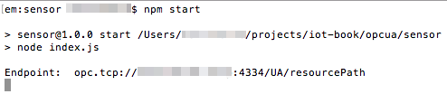
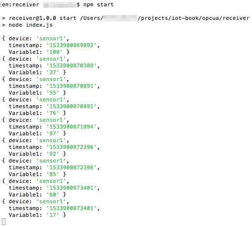
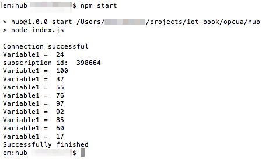

# Application level protocols: OPC UA
This example shows an application which runs on Raspberry Pi, collects data from OPC-UA simulator and sends the data to the cloud

## Software
* [Node.js 6+](https://nodejs.org/en/download/)
* [PostgreSQL](https://www.postgresql.org/download/)
* [CF CLI](https://github.com/cloudfoundry/cli#downloads)
* [request](https://www.npmjs.com/package/request)
* [node-opcua](https://www.npmjs.com/package/node-opcua)
* [async](https://www.npmjs.com/package/async)
* [Docker](https://docs.docker.com/engine/installation/)

## Prepare hardware components
* Raspberry Pi 3 (Model B)
* Power Adapter (2A/5V)
* MicroSD Card (8GB+) and SD Adapter
* Ethernet cable for wired network connection

## Prepare SD card
* Download [the latest Raspbian LITE image](https://www.raspberrypi.org/downloads/raspbian/)
* Connect you SD card to your computer and use [Etcher](https://etcher.io/) to flash the Raspbian .img-file to the SD card
* Enable SSH:
  ```
  cd /Volumes/boot
  touch ssh
  ```
* To enable Wi-Fi create `wpa_supplicant.conf` with the following content:
  ```
  network={
      ssid="YOUR_SSID"
      psk="YOUR_WIFI_PASSWORD"
  }
  ```
* Create folder `/home/pi/hub`
* Create file `/home/pi/hub/package.json` with the following contents:
  ```
  {
    "name": "hub",
    "version": "1.0.0",
    "description": "",
    "main": "index.js",
    "scripts": {
      "start": "node index.js",
      "test": "echo \"Error: no test specified\" && exit 1"
    },
    "author": "",
    "license": "ISC",
    "dependencies": {
      "async": "^2.4.0",
      "node-opcua": "0.0.64",
      "request": "^2.81.0"
    }
  }
  ```
* Create file `/home/pi/hub/index.js` with the following contents, replacing `REMOTE-SERVER-ADDRESS.com` and `REMOTE-SENSOR-ADDRESS` with real values:
  ```
  var opcua = require("node-opcua");
  var async = require("async");
  var request = require("request");

  var session, subscription;
  var client = new opcua.OPCUAClient();
  var sensor = "opc.tcp://REMOTE-SENSOR-ADDRESS:4334/UA/resourcePath";
  var receiver = "http://REMOTE-SERVER-ADDRESS.com:8080";

  async.series(
    [
      // establishing connection
      function (cb) {
        client.connect(sensor, function (err) {
          if (err) {
            console.log("Connection to " + sensor + "failed");
          } else {
            console.log("Connection successful");
          }
          cb(err);
        });
      },

      // start session
      function (cb) {
        client.createSession(function (err, res) {
          if (!err) session = res;
          cb(err);
        });
      },

      // read value
      function (cb) {
        session.readVariableValue("ns=1;s=Variable1", function (err, dataValue) {
          if (!err) console.log("Variable1 = ", dataValue.value.value);
          cb(err);
        });
      },

      // write value
      function (cb) {
        session.writeSingleNode("ns=1;s=Variable1", new opcua.Variant({
          dataType: opcua.DataType.Double,
          value: 100
        }), function (err) {
          cb(err);
        });
      },

      // subscribe to changes
      function (cb) {
        subscription = new opcua.ClientSubscription(session, {
          maxNotificationsPerPublish: 5,
          priority: 5,
          publishingEnabled: true,
          requestedLifetimeCount: 5,
          requestedMaxKeepAliveCount: 3,
          requestedPublishingInterval: 500,
        });

        subscription.on("started", function () {
          console.log("subscription id: ", subscription.subscriptionId);
        }).on("terminated", function () {
          cb();
        });

        setTimeout(function () {
          subscription.terminate();
        }, 10000);

        // install monitored item
        var monitor = subscription.monitor({
            attributeId: opcua.AttributeIds.Value,
            nodeId: opcua.resolveNodeId("ns=1;s=Variable1"),
          },
          {
            discardOldest: true,
            samplingInterval: 50,
            queueSize: 5,
          },
          opcua.read_service.TimestampsToReturn.Both
        );

        monitor.on("changed", function (dataValue) {
          console.log("Variable1 = ", dataValue.value.value);

          // send to receiver
          var data = {
            device: "sensor1",
            timestamp: Date.now(),
            Variable1: dataValue.value.value
          };
          request.post({url: receiver, form: data}, function (err) {
            if (err) console.log("Failed to send " + JSON.stringify(data) + " to " + receiver);
          });
        });
      },

      // close session
      function (cb) {
        session.close(function (err) {
          if (err) console.log("Failed to close session");
          cb();
        });
      }
    ],

    function (err) {
      if (err) {
        console.log("Failed with error:", err);
      } else {
        console.log("Successfully finished");
      }
      client.disconnect(function () {
      });
    }
  );
  ```
* Create file `/home/pi/hub/Dockerfile` with the following contents:
  ```
  FROM hypriot/rpi-node:boron-onbuild
  ```
* Create folder `/home/pi/sensor`
* Create file `/home/pi/sensor/package.json` with the following contents:
   ```
  {
    "name": "sensor",
    "version": "1.0.0",
    "description": "",
    "main": "index.js",
    "scripts": {
      "start": "node index.js",
      "test": "echo \"Error: no test specified\" && exit 1"
    },
    "author": "",
    "license": "ISC",
    "dependencies": {
      "node-opcua": "0.0.64"
    }
  }
  ```
* Create file `/home/pi/sensor/index.js` with the following contents:
   ```
  var opcua = require("node-opcua");
  var min = 1;
  var max = 100;

  var host = new opcua.OPCUAServer({
    buildInfo: {
      buildDate: new Date(2018, 8, 8),
      buildNumber: "1234",
      productName: "productName",
    },
    port: 4334,
    resourcePath: "UA/resourcePath",
  });

  host.initialize(function () {
    var space = host.engine.addressSpace;
  
    var componentOf = space.addObject({
      browseName: "browseName",
      organizedBy: space.rootFolder.objects,
    });

    var variable1 = 0;

    // generate new value
    setInterval(function () {
      variable1 = Math.floor(max - Math.random() * (max - min));
    }, 500);

    space.addVariable({
      browseName: "browseName",
      componentOf: componentOf,
      dataType: "Double",
      nodeId: "ns=1;s=Variable1", // a string nodeID
      value: {
        get: function () {
          return new opcua.Variant({dataType: opcua.DataType.Double, value: variable1});
        },
        set: function (variant) {
          variable1 = parseFloat(variant.value);
          return opcua.StatusCodes.Good;
        }
      }
    });

    host.start(function () {
      var endpoint = host.endpoints[0].endpointDescriptions()[0].endpointUrl;
      console.log("Endpoint: ", endpoint);
    });
  });
   ```
* Configure min and max values in the beggining of file `/home/pi/sensor/index.js`
* Create file `/home/pi/sensor/Dockerfile` with the following contents:
  ```
  FROM hypriot/rpi-node:boron-onbuild
  ```

## Run simulator application on RPi
* Insert SD card into the RPi
* Connect Ethernet cable and open SSH connection
* Open SSH connection
* Navigate to `/home/pi/sensor`
* Build an image and run Docker container:
  ```
  # Build an image from a Dockerfile
  docker build -t opcua-sensor .
  #
  # Run container in foreground
  docker run -p 4334:4334 --privileged -it --rm --name opcua-sensor-container opcua-sensor
  #
  # Run container in background
  # docker run -p 4334:4334 --privileged -d  --rm --name opcua-sensor-container opcua-sensor
  #
  # Fetch the logs of a container
  # docker logs -f opcua-sensor-container
  #
  # Stop running container
  # docker stop opcua-sensor-container
  ```
  

## Run the receiver application on your PC
* Install and launch PostgreSQL container:
  ```
  docker run --rm --name postgres-container -e POSTGRES_PASSWORD=password -it -p 5433:5432 postgres
  
  docker exec -it postgres-container createdb -U postgres iot-book
  ```
* Create folder `receiver`
* Create file `./receiver/package.json` with the following contents:
   ```
  {
    "name": "receiver",
    "version": "1.0.0",
    "description": "",
    "main": "index.js",
    "scripts": {
      "start": "node index.js",
      "test": "echo \"Error: no test specified\" && exit 1"
    },
    "author": "",
    "license": "ISC",
    "dependencies": {
      "pg": "^6.2.3"
    }
  }
  ```
* Create file `./receiver/index.js` with the following contents, replacing database credentials with the correct ones:
   ```
  var restify = require('restify');
  var server = restify.createServer({name: 'MyApp'});
  server.use(restify.bodyParser());

  var Pool = require('pg').Pool;
  var pool = new Pool({
    user: 'postgres',
    database: 'iot-book',
    password: 'password',
    host: 'host',
    port: 5433
  });

  //ensure table exists in db
  pool.query('CREATE TABLE IF NOT EXISTS "sensor-logs" (id serial NOT NULL PRIMARY KEY, data json NOT NULL)', function (err, result) {
    if (err) console.log(err);
  });

  server.post('/', function create(req, res, next) {
    console.log(req.params);

    //save in db
    pool.query('INSERT INTO "sensor-logs" (data) VALUES ($1)', [req.params], function (err, result) {
      if (err) console.log(err);
      res.send(201, result);
    });

    return next();
  });

  server.get('/stats', function search(req, res, next) {
    pool.query('SELECT AVG("Variable1"), MAX("Variable1"), MIN("Variable1"), COUNT(*), SUM("Variable1") FROM (SELECT (data->>\'Variable1\')::int "Variable1" FROM "sensor-logs" ORDER BY id DESC LIMIT 10) data', function (err, result) {
      if (err) console.log(err);
      res.send(result.rows);
    });
    return next();
  });

  server.listen(process.env.PORT || 8080);
   ```
* Create file `./receiver/Dockerfile` with the following contents:
   ```
  FROM node:boron-onbuild
  
  EXPOSE 8080
   ```
* Build an image and run Docker container:
  ```
  # Build an image from a Dockerfile
  docker build -t opcua-receiver .
  
  # Run container in foreground
  docker run -p 8080:8080 -it --rm --name opcua-receiver-container opcua-receiver
  
  # Run container in background
  # docker run -p 8080:8080 -d  --rm --name opcua-receiver-container opcua-receiver
  
  # Fetch the logs of a container
  # docker logs -f opcua-sensor-container
  
  # Stop running container
  # docker stop opcua-receiver-container
  ```
  

## Run the receiver in the Predix
* Install and point CF CLI to your Predix account
* Create PostgreSQL service and obtain credentials
* Create file `./receiver/manifest.yml` with the following contents:
   ```
  applications:
  -
    name: receiver
    memory: 128M
    random-route: true
   ```
* Replace database credentials in `./receiver/index.js`
* Deploy to the cloud:
  ```
  cf push
  ```
* Change the REMOTE-SERVER-ADDRESS in `hub` application on RPi to the newly deployed `receiver`

## Run hub application on RPi
* Open SSH connection
* Navigate to `/home/pi/hub`
* Build an image and run Docker container:
  ```
  # Build an image from a Dockerfile
  docker build -t opcua-hub .
  #
  # Run container in foreground
  docker run --privileged -it --rm --name opcua-hub-container opcua-hub
  #
  # Run container in background
  # docker run --privileged -d  --rm --name opcua-hub-container opcua-hub
  #
  # Fetch the logs of a container
  # docker logs -f opcua-hub-container
  #
  # Stop running container
  # docker stop opcua-hub-container
  ```
  

## Get stats
* Open browser
* Navigate to `http://RECEIVER-ADDRESS:8080/stats` or `https://RECEIVER-IN-PREDIX/stats`
* Get stats
  ```
    [{"avg":"47.8000000000000000","max":97,"min":8,"count":"10","sum":"478"}]
  ```
