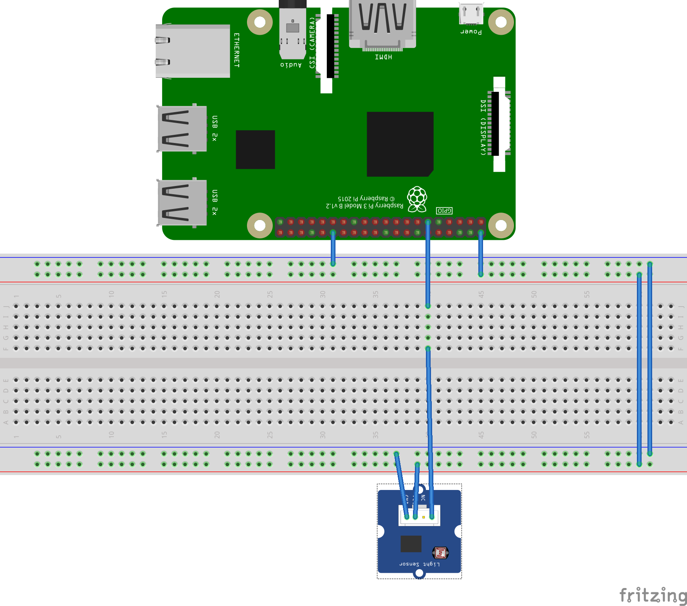
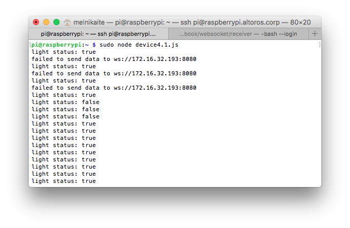
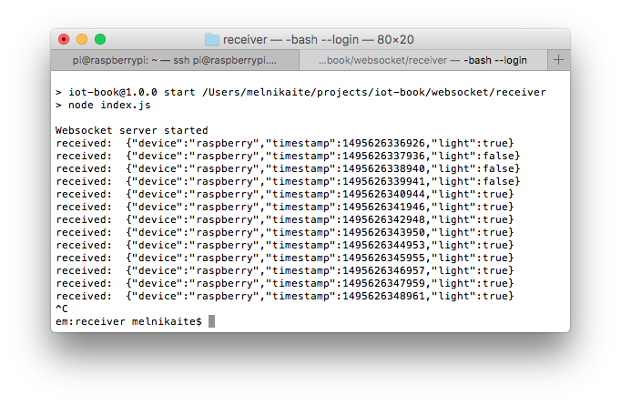

# Application level protocols: WebSocket
This example shows an application which runs on Raspberry Pi and sends data from XD-80 Light Sensor module

## Software
* [Node.js 6+](https://nodejs.org/en/download/)
* [rpio](https://www.npmjs.com/package/rpio)
* [ws](https://www.npmjs.com/package/ws)
* [Docker](https://docs.docker.com/engine/installation/)

## Prepare hardware components
* Raspberry Pi 3 (Model B)
* Power Adapter (2A/5V)
* MicroSD Card (8GB+) and SD Adapter
* XD-80 Light Sensor module
* Breadboard and a set of dupont cables
* Ethernet cable for wired network connection

## Assemble the device


## Prepare SD card
* Download [the latest Raspbian LITE image](https://www.raspberrypi.org/downloads/raspbian/)
* Connect you SD card to your computer and use [Etcher](https://etcher.io/) to flash the Raspbian .img-file to the SD card
* Enable SSH:
  ```
  cd /Volumes/boot
  touch ssh
  ```
* To enable Wi-Fi create `wpa_supplicant.conf` with the following content:
  ```
  network={
      ssid="YOUR_SSID"
      psk="YOUR_WIFI_PASSWORD"
  }
  ```
* Create folder `/home/pi/sensor`
* Create file `/home/pi/sensor/package.json` with the following contents:
  ```
  {
    "name": "sensor",
    "version": "1.0.0",
    "description": "",
    "main": "index.js",
    "scripts": {
      "start": "node index.js",
      "test": "echo \"Error: no test specified\" && exit 1"
    },
    "author": "",
    "license": "ISC",
    "dependencies": {
      "rpio": "^0.9.16",
      "ws": "^2.3.1"
    }
  }
  ```
* Create file `/home/pi/sensor/index.js` with the following contents, replacing `REMOTE-SERVER-ADDRESS.com` with real value:
  ```
  var WebSocket = require('ws');
  var rpio = require('rpio');

  var ws;
  var receiver = 'ws://REMOTE-SERVER-ADDRESS.com:8080';
  rpio.open(11, rpio.INPUT);

  var establishConnection = function () {
    ws = new WebSocket(receiver);
    ws.on('close', establishConnection);
    ws.on('error', establishConnection);
  };
  establishConnection();

  var sendStatus = function () {
    var status = rpio.read(11) === 0;
    console.log('light status: ' + status);

    var data = JSON.stringify({
      device: 'raspberry',
      timestamp: Date.now(),
      light: status
    });

    try { ws.send(data); }
    catch (e) { console.log('failed to send data to ' + receiver); }

    setTimeout(sendStatus, 1000);
  };
  sendStatus();
  ```
* Create file `/home/pi/sensor/Dockerfile` with the following contents:
  ```
  FROM hypriot/rpi-node:boron-onbuild
  ```

## Run the sensor application on RPi
* Insert SD card into the RPi
* Connect Ethernet cable and open SSH connection
* Navigate to `/home/pi/sensor`
* Build an image and run Docker container:
  ```
  # Build an image from a Dockerfile
  docker build -t websocket-sensor .
  #
  # Run container in foreground
  docker run --privileged -it --rm --name websocket-sensor-container websocket-sensor
  #
  # Run container in background
  # docker run --privileged -d  --rm --name websocket-sensor-container websocket-sensor
  #
  # Fetch the logs of a container
  # docker logs -f websocket-sensor-container
  #
  # Stop running container
  # docker stop websocket-sensor-container
  ```
  

## Run the receiver application on your PC
* Create folder `receiver`
* Create file `./receiver/package.json` with the following contents:
   ```
  {
    "name": "receiver",
    "version": "1.0.0",
    "description": "",
    "main": "index.js",
    "scripts": {
      "start": "node index.js",
      "test": "echo \"Error: no test specified\" && exit 1"
    },
    "author": "",
    "license": "ISC",
    "dependencies": {
      "ws": "^2.3.1"
    }
  }
  ```
* Create file `./receiver/index.js` with the following contents:
   ```
  const WebSocket = require('ws');

  const wss = new WebSocket.Server({port: 8080}, function () {
    console.log('Websocket server started');
  });

  wss.on('connection', function connection(ws) {
    ws.on('message', function incoming(message) {
      console.log('received: ', message);
    });

    // Send message to connected client
    ws.send('hello, client');
  });
   ```
* Create file `./receiver/Dockerfile` with the following contents:
   ```
  FROM node:boron-onbuild
  
  EXPOSE 8080
   ```
* Navigate to `./receiver`
* Build an image and run Docker container:
  ```
  # Build an image from a Dockerfile
  docker build -t websocket-receiver .
  
  # Run container in foreground
  docker run -p 8080:8080 -it --rm --name websocket-receiver-container websocket-receiver
  
  # Run container in background
  # docker run -p 8080:8080 -d  --rm --name websocket-receiver-container websocket-receiver
  
  # Fetch the logs of a container
  # docker logs -f websocket-sensor-container
  
  # Stop running container
  # docker stop websocket-receiver-container
  ```
  
